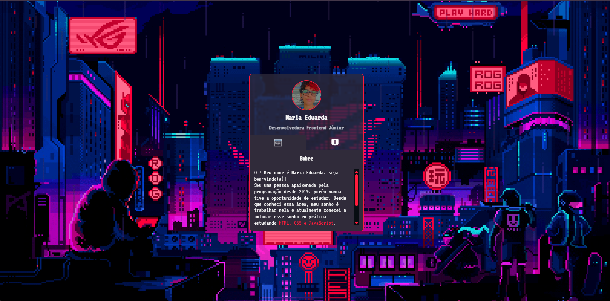
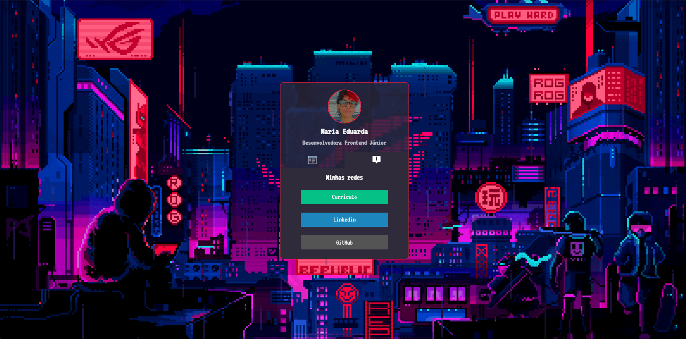

# 👩‍💻 Mini Portfólio — MapaDev Week

Mini portfólio desenvolvido durante a **MapaDev Week**, evento promovido pelo **Dev em Dobro**, em 2022.

O projeto foi utilizado como prática de **HTML, CSS e JavaScript**, com o objetivo de criar uma página pessoal interativa contendo informações sobre mim e links para minhas redes.

---

## 📸 Preview

### Sobre mim

  

### Minhas redes

  

---

## 💻 Sobre o projeto

Este projeto foi desenvolvido durante a **MapaDev Week**, evento realizado pelo **Dev em Dobro**.

Durante as aulas, acompanhei a construção de um mini portfólio utilizando **HTML, CSS e JavaScript**, aplicando os conceitos apresentados para criar minha própria versão da página.

O projeto possui uma interface em formato de cartão, com abas para apresentar informações pessoais e links para redes sociais.

Mantive este projeto no GitHub como registro dos meus primeiros estudos de desenvolvimento Front-end e da minha evolução na programação.

---

## 🛠️ Tecnologias utilizadas

- HTML5
- CSS3
- JavaScript

---

## ✨ Funcionalidades

- Apresentação pessoal
- Aba "Sobre mim"
- Aba de redes sociais
- Navegação entre abas
- Links externos
- Interface em formato de cartão
- Interações utilizando JavaScript

---

## 🚀 Acesse o projeto

🔗 [Visualizar projeto](https://luutsuk.github.io/mini-portfolio-MapaDevWeek/)

💻 [Ver código no GitHub](https://github.com/LuuTsuk/mini-portfolio-MapaDevWeek)

---

## 📚 O que pratiquei

Durante o desenvolvimento deste projeto, pratiquei:

- Estruturação de páginas com HTML
- Estilização com CSS
- Classes e seletores
- Organização de elementos visuais
- Manipulação do DOM
- Eventos de clique
- Navegação entre abas
- Integração entre HTML, CSS e JavaScript
- Criação de uma interface pessoal

---

## 🎓 Sobre o evento

Este projeto foi desenvolvido durante a:

**MapaDev Week — Dev em Dobro**

📅 **Ano:** 2022  
💻 **Conteúdos praticados:** HTML, CSS e JavaScript

O evento foi utilizado como parte dos meus estudos iniciais de desenvolvimento Front-end.

---

## 🔗 Referência

Evento e projeto desenvolvidos com orientação do **Dev em Dobro**.

🔗 [GitHub do Dev em Dobro](https://github.com/devemdobro)

---

  Projeto desenvolvido durante meus estudos iniciais de Front-end. 🚀

